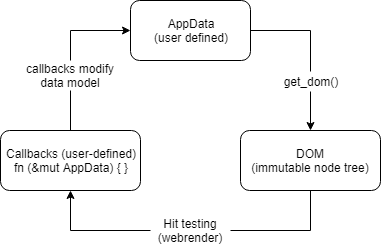
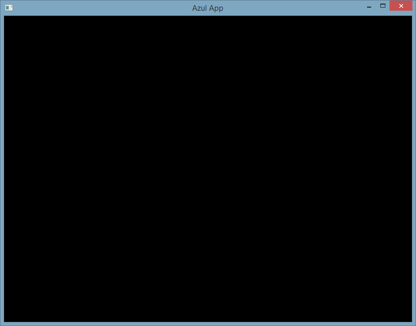

## The DOM approach

Azul does not work like many other GUI frameworks. Other GUI frameworks
allow you to create "objects", like a "Button", then hook up functions
that are called when the button is clicked. Azul works more like a browser,
where you can add and remove nodes in a so-called "Document Object Model"
or "DOM" for short. Each node carries some data (an image, text, shape,
drawing area or window) or a sub-element, which, in turn, is another DOM node.
This create a tree-like data structure, often referred to as a "DOM tree".

The benefit of this approach is that it is incredibly flexible - with just
a few basic widget types, you can compose new DOM trees from existing ones,
conditionally show / hide them from the user, style them based on their
relations to each other and more, without the DOM ever "knowing" anything
about your applications data. This is good practice, since when you change
the UI of your app, you don't need to change how your app operates - the
model stays the same while the UI changes.

## Uni-directional data flow

Azul has a "uni-directional data flow", which means that the data going
back and forth between user inputs and your application always flows in
one direction between two stages. Azul has three stages that are executed
in a loop (similar to a game engine):

1. Creating the DOM from your applications data
2. Redrawing the screen and testing if the user has interacted with the application
3. Modifying the data model according to user input, then go to step 1



At no point does the DOM know how the application structure looks like internally
or can modify the data behind your back. Azul views a user interface as a "view"
into your application and generates the whole DOM every time it needs to redraw
the screen. There are no button.setText()/ button.getText() functions - the DOM
doesn't know anything about what it stores and you cannot get any information out
of the DOM once you've generated it.

## Hello World

The following code gives you a feel for what a minimal application in Azul looks like:

```rust
extern crate azul;

use azul::prelude::*;

struct MyDataModel { }

impl Layout for MyDataModel {
    fn layout(&self, _: WindowId) -> Dom<MyDataModel> {
        Dom::new(NodeType::Div)
    }
}

fn main() {
    let css = Css::native();
    let app_data = MyDataModel { };
    let mut app = App::new(app_data);
    app.create_window(WindowCreateOptions::default(), css).unwrap();
    app.run();
}
```

If you run this code, you should get a window like this:



The reason the window is black is not because it hasn't been
drawn to, but because the default color for the root element is black.
There is a root `div` element in the window - the default layout
model of Azul is `display:flex` so that one element always stretches to
its maximum size. In this case, the maximum size is the window width and
height.

## An in-depth look

### The data model

The first step towards writing an Azul app is to declare your data model:

```rust
struct MyDataModel { }
```

This is where you store everything for your application. Yes, everything:
all database connections, all email content, passwords, user names, you name it. Of course,
you can make sub-structs for all these details, but the `MyDataModel` is essentially
one big object which all callbacks may have access too (we get into best practices
with these later). In the end, your data model will probably look something like this:

```rust
struct MyDataModel {
    users: Vec<User>,
    app_configuration: Config,
    database_connection: Option<Connection>,
}

struct Config {
    show_sidebar: bool,
}

struct User {
    name: String,
    password: String,
    photo: Option<Icon>,
}

// and so on ... this struct can get quite large, but that's OK.
```

Azul itself never accesses this struct. It only needs it to hand it to the callbacks.
It wraps the data model in an `Arc<Mutex<DataModel>>`, so that it can be asynchronously
changed on multiple threads (we'll get to asynchronous tasks later).


### The Layout trait

Azul views a "user interface" as a "view" into your data. While you are generating the
view, you cannot change the data in your model at all.

The `Layout` trait is the most important trait to understand. It is defined as:

```rust
pub trait Layout {
    fn layout(&self, window_id: WindowId) -> Dom<Self> where Self: Sized;
}
```

The layout function has to return a `Dom<T>` where the `T` is the class you are
implementing the trait for, i.e. `Dom<MyDataModel>`. Azul uses this information to
later call functions and hand them a mutable reference to that `T`.

The `WindowId` is necessary so you can return different UIs for different windows.
This is how azul implements sending data across multiple windows - since the data
model isn't bound to any window, information in one window can update the information
in another window.

Note that the `layout` function takes a `&self`, not a `&mut self`: you can think of
the `layout` function like a mapping function that transforms the application state
into a user interface: `state.map(|data| data.to_dom())`.

Earlier I mentioned that azul wraps your data in an `Arc<Mutex<T>>`. This means that
as long as the `layout` function is running, the `Mutex` holding the `&self` is locked -
keep this in mind for when we get into async I/O.

### The DOM struct

The `Dom` struct is fairly simple: It stores a bunch of nodes that each have one parent node
(except for the root node, which has the window itself as the parent). Internally, it uses
an arena to allocate the nodes.

Each node has to has a type. `NodeType`s are the foundation, the building blocks of azul,
from which all other widget can be built via composition:

```rust
pub enum NodeType {
    Div,
    Label(String),
    BlobText(BlobTextId),
    SvgLayer(SvgLayerId),
    Image(ImageId),
    GlTexture,
}
```

All other widgets that you are going to see later simply build a DOM tree themselves,
by combining nodes or sub-dom-trees into larger widgets. Our DOM is very simple:

```
window (dimensions: 800x600)
  └──── div (max_size: 800x600)
```

Since we haven't restricted the div in width or height, it fills up the whole window.
In the CSS chapter we'll go over the CSS attributes and how to style your app. For now,
we'll use the native styles.

The DOM node itself however does not only carry its data, it also carries three other
attributes:

- An optional CSS class
- An optional CSS ID
- A list of callbacks to call when the item is interacted with (empty by default)

In contrast to HTML, azuls DOM nodes are not extensible - you can't set any
attribute to something else or add custom attributes (in the name of performance).

Each DOM object can be appended to using the builder style `with_*` or the imperative
`set_*` or `add_*` functions (i.e. `dom.with_`). Both styles have their place, usually `set_*`
functions are easier to handle in loops, while the builder style is better for short
elements:

```rust
let mut dom = Dom::new(NodeType::Div);
for i in 0..100 {
    dom.add_child(NodeType::Label(format!("{}", i)));
}
dom
```

but for single elements:

```rust
Dom::new(NodeType::Div)
    .with_child(label(format!("{}", i)))
```

### Running the application

Before we can run the application, we have to do the minimal amount of setup:

1. Initialize your data model and hand it to azul
2. Add the CSS to the app, so that azul knows how to draw the elements
3. Open a window

```rust
let css = Css::native();
```

Azul has built-in styles for all common elements that are styled to look like
platform-native widgets. You can override styles if you don't like them,
we'll get to that in the later tutorials.

```rust
let mut app = App::new(MyDataModel { });
```

The `azul::App` stores, initializes and manages all image / fonts resources,
windows, threads and the data model for you. You will never interact with the
`App` directly, but it is still useful to know that it exists. In order to initialize
the app, you have to create the "default" state of your application, i.e. what should
be shown to the user when the app starts up.

```rust
app.create_window(WindowCreateOptions::default, css).unwrap();
```

If you do not create at least one window, azul immediately exits.
In the WindowCreateOptions, you can set if the window should have decorations,
transparency, fullscreen mode or a certain position, etc.

```rust
app.run();
```

And we are live. Quite a journey, wasn't it? This function keeps running forever,
until last window has closed (either by the user or by the application itself).

### Automatic updates

Azul determines when it should call the `layout()` function again. By default,
azul is very retained - it only repaints the screen when it's absolutely necessary.
The process of determining which elements should be re-layouted, how elements
should be layouted is fairly complex. You don't need to care about this, but it
is useful to know the why and not only the what.

Internally, azul creates hashes for each node in the `Dom`. It compares these
nodes with the previous frame to determine which layout constraints are unused,
invalidated or changed. Hashing large objects, such as images or large texts is slow.
Therefore azul has a mechanism: the `NodeType` uses IDs instead of the content
itself. You have to register these IDs, which creates the initial resource and caches
them.

Usually, you know when large resources are edited. For small items, such as a simple
username, it isn't necessary to jump through hoops for registering a string, storing the ID,
then using the ID to draw it. It is not going to make a large impact on the performance
of your app. However, if you are writing a text editor, the situation is quite different -
you wouldn't want a 10KB novel to be hashed at 60FPS - that's simply a waste of resources.
However, you usually know when the novel is going to be edited (i.e. in the `onkeyup` event).
So then you can simply listen on that event and invalidate the text only when it is edited
(not when it is scrolled, for example). This is why there are two text APIs
(`Label` and `BlobText`).

The common model is that you store the IDs for large resources (images, polygons,
large amounts of text) in your app model. If a resource is not available, azul will
crash (in debug and test mode only) or simply not draw the resource (in release mode).

## Conclusion

Now that you know how Azul runs your application, we're going to build a simple
application where a user can click a button and increment a counter, to show how
to handle callbacks easily.